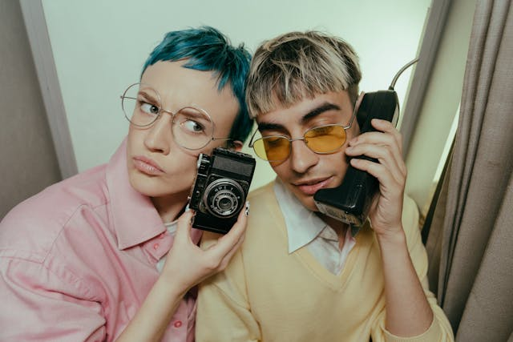
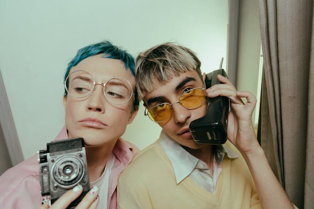
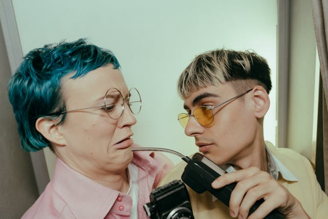

# Attributions

## Images

### Marketing Photos

All marketing photos by [cottonbro studio](https://www.pexels.com/@cottonbro/) from [Pexels](https://www.pexels.com/) under the [Pexels License](https://www.pexels.com/license/) (free for commercial use, no attribution required).

[Source](https://www.pexels.com/photo/man-in-black-framed-eyeglasses-holding-black-camera-4858865/)

[Source](https://www.pexels.com/photo/woman-in-pink-shirt-holding-black-and-silver-camera-4858868/)

[Source](https://www.pexels.com/photo/man-in-pink-button-up-shirt-holding-black-smartphone-4858878/)

[Source](https://www.pexels.com/photo/woman-in-pink-collared-shirt-holding-black-camera-4858880/)

### Pattern Images

All pattern images sourced from [Pixabay](https://pixabay.com/) under the [Pixabay Content License](https://pixabay.com/service/license-summary/) (free for commercial use, no attribution required).

1. Image by [Natalie](https://pixabay.com/users/chekiwart-13606048/) from Pixabay - [Source](https://pixabay.com/vectors/leaves-pattern-art-design-nature-6629581/)

2. Image by [yayang art](https://pixabay.com/users/yayangart-13477958/) from Pixabay - [Source](https://pixabay.com/vectors/flowers-floral-bloom-blossom-8289321/)

3. Image by [yayang art](https://pixabay.com/users/yayangart-13477958/) from Pixabay - [Source](https://pixabay.com/vectors/flowers-floral-bloom-blossom-8289320/)

4. Image by [yayang art](https://pixabay.com/users/yayangart-13477958/) from Pixabay - [Source](https://pixabay.com/vectors/flowers-autumn-backdrop-background-8876324/)

5. Image by [bookdragon](https://pixabay.com/users/bookdragon-72424/) from Pixabay - [Source](https://pixabay.com/vectors/roses-love-hearts-pattern-7693029/)

6. Image by [A K](https://pixabay.com/users/monstreh-637659/) from Pixabay - [Source](https://pixabay.com/vectors/pattern-fish-carp-koi-koi-carp-3296033/)

7. Image by [Евгения](https://pixabay.com/users/tanrıca-29544755/) from Pixabay - [Source](https://pixabay.com/vectors/flowers-leaves-plants-botanical-9694631/)

8. Image by [A K](https://pixabay.com/users/monstreh-637659/) from Pixabay - [Source](https://pixabay.com/vectors/pattern-the-culture-seamless-728510/)

9. Image by [OpenClipart-Vectors](https://pixabay.com/users/openclipart-vectors-30363/) from Pixabay - [Source](https://pixabay.com/vectors/victorian-background-decoration-153131/)

10. Image by [Ivan Kot](https://pixabay.com/users/vectorhight-22450559/) from Pixabay - [Source](https://pixabay.com/vectors/flower-seamless-textile-vintage-9294773/)

## CSS Filters

- [CSSgram](https://github.com/una/CSSgram) by [Una Kravets](https://github.com/una) - MIT License
